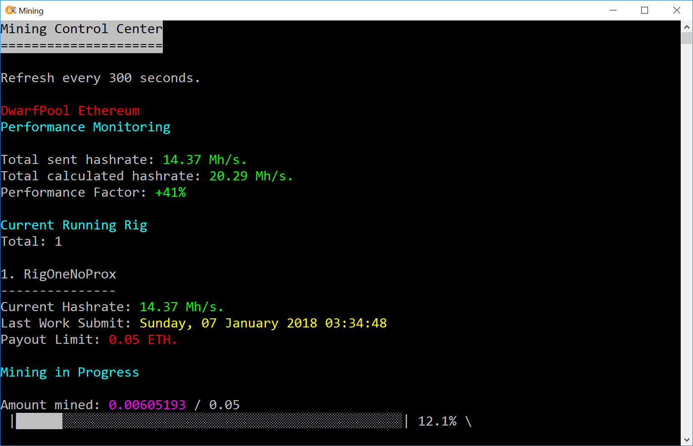

# Mining-Control-Center
Small Console Application to Control Mining Script

## Version 1.0

- Support for Dwarfpool Ethereum mining monitoring. (DwarfPool API)

*Configuration Options*
  
- Wallet Address
- Payout Progression Tracking threshold

# Project Overview

__Mining Control Center__

A simple performance monitoring console application written in **.NET Core.** 

The appllication utilises DwarfPool API to give a real time ETH mining performance statistics. 

**Features**
1. Progress Bar (Payout threshold indicator)
2. Live hashrate monitoring.

_Screenshots_

__Ethereum Mining Rig__

A custom built ethereum mining rig. 

**Specification** 
1. ASUS B250 MINING EXPERT LGA1151 DDR4
2. Gigabyte GeForce GTX 1070 OC WindForce **(x6)**
3. Cooler Master V-Series 750W PSU **(x2)**
4. Intel Skylake Pentium G4400 3.5 Ghz Dual core
5. Crucial 4GB DESKTOP DDR4 RAM
6. PC-Riser **(x6)**

Performance: **192 MH/s.**

_Screenshots_

## Roadmap

29th January 2018

**30th January 2018**

Project Completed

**5th February cooling fans installed.**

